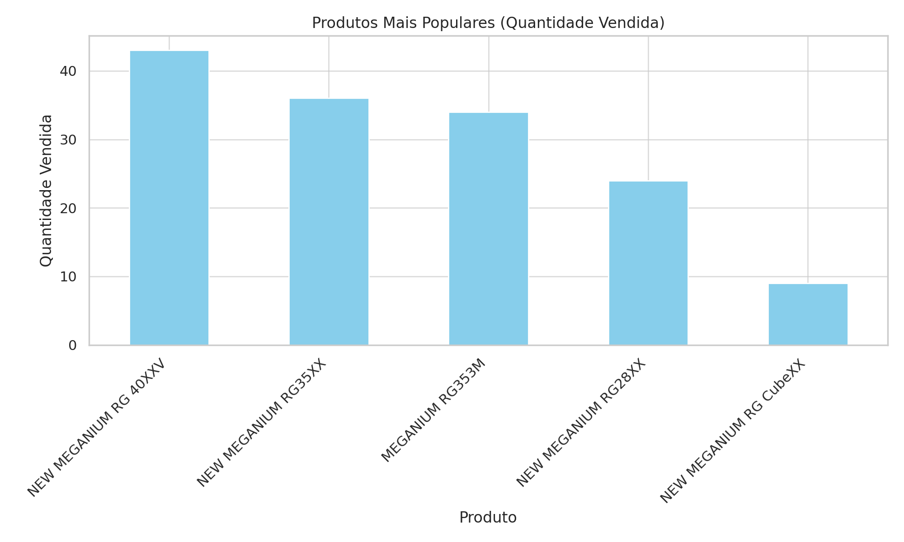
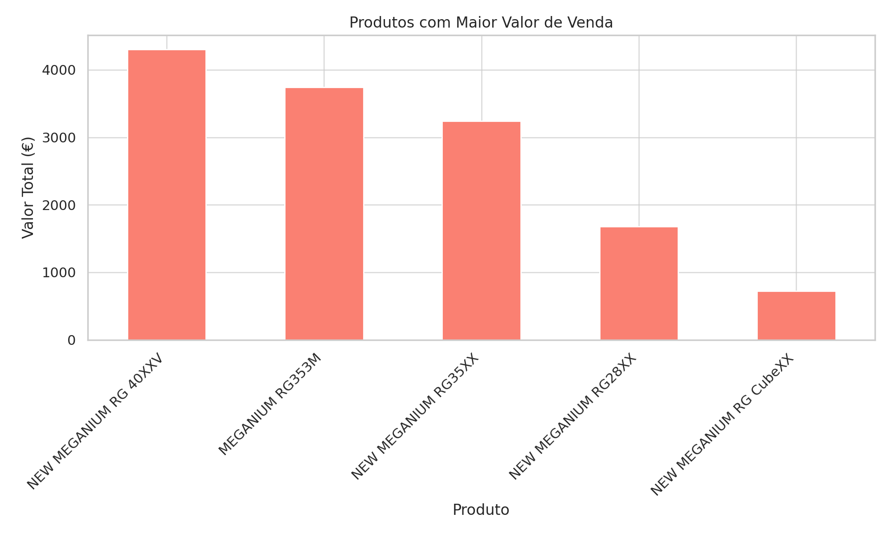
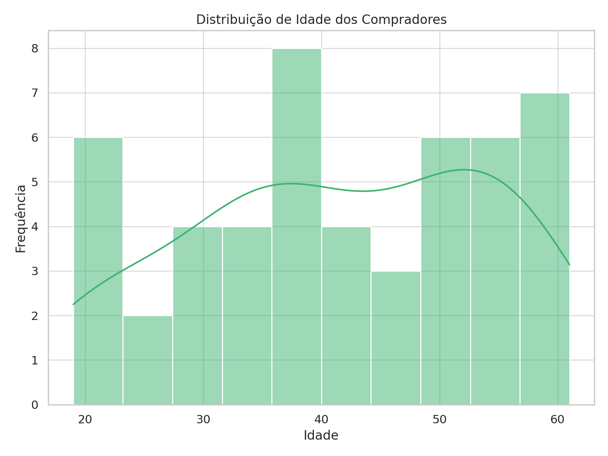

# 🎮 Análise de Vendas de Consoles Meganium

Este projeto analisa os dados de vendas de uma empresa que fabrica consoles, mas delega a venda e distribuição para terceiros. O objetivo é extrair insights sobre os produtos, perfil de compradores e propor estratégias de otimização logística.

## 🔍 Principais Insights

### ✅ Produtos Mais Populares (por quantidade vendida):
1. **NEW MEGANIUM RG 40XXV** – 43 unidades  
2. **NEW MEGANIUM RG35XX** – 36 unidades  
3. **MEGANIUM RG353M** – 34 unidades  
4. **NEW MEGANIUM RG28XX** – 24 unidades  
5. **NEW MEGANIUM RG CubeXX** – 9 unidades  

---

### 🏆 Produtos Líderes de Venda (por valor total arrecadado):
1. **NEW MEGANIUM RG 40XXV** – €4.300  
2. **MEGANIUM RG353M** – €3.740  
3. **NEW MEGANIUM RG35XX** – €3.240  

---

### 👥 Idade Média dos Compradores:
- **41,6 anos**

---

## 🌍 Oportunidades Estratégicas

- **Foco em canais de alto volume como Shopee.**
- **Internacionalização exige estratégias logísticas localizadas (EUA, Canadá, Alemanha).**
- **Uso de cupons impacta a margem de lucro e deve ser monitorado.**
- **Moedas múltiplas (EUR, USD, GBP) sugerem necessidade de controle cambial.**

---

## 🚚 Sugestões de Otimização Logística

- Clusterizar destinos para montar centros regionais de distribuição.
- Parcerias com transportadoras locais confiáveis por região.
- Consolidar pedidos para reduzir frete.
- Implementar previsão de demanda com base em dados históricos.
- Monitorar variações cambiais para proteger a margem.

